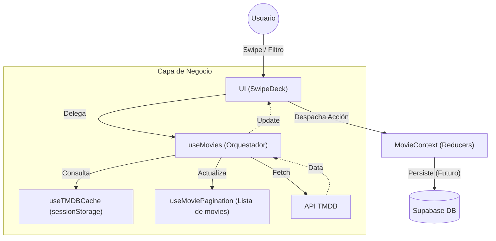

# Arquitectura de CineSwipe

Este documento detalla la estructura y arquitectura de la aplicación web CineSwipe, construida con React 18, Vite, TypeScript y Tailwind CSS, apoyada únicamente en React Context + useReducer para el manejo de estado.

## 1. Estructura de Directorios

```text
src/
├── assets/
│   └── images/         # Recursos estáticos locales
├── components/
│   ├── common/         # Componentes UI reutilizables (Botones, Loaders, Layouts)
│   ├── movies/         # Componentes representacionales de películas (Deck, Cards)
│   └── search/         # Componentes representacionales para filtros y búsqueda
├── context/
│   ├── movies/         # Estado global (Context) y mutaciones (useReducer)
├── hooks/
│   ├── movies/         # Lógica de negocio (useMovies, useTMDBCache, useMoviePagination)
│   └── shared/         # Hooks genéricos (useDebounce)
├── lib/
│   └── supabase.ts     # Cliente de Supabase configurado
├── types/
│   ├── tmdb.types.ts   # Interfaces de la API de TMDB
│   └── supabase.ts     # Tipos autogenerados de la DB
├── App.tsx             # Árbol principal
└── main.tsx            # Punto de montaje principal
```

## 2. Definición de Módulos y Responsabilidades

| Módulo / Carpeta | Responsabilidad | Archivos Clave |
|------------------|-----------------|----------------|
| `components/movies` | Renderizar tarjetas con Tailwind. Capturar gestos/swipes delegando la física y resolución a los Hooks. No maneja estados pesados. | `SwipeDeck.tsx`, `MovieCard.tsx` |
| `components/search` | UI de filtros (genero, año) y barras de entrada. Envían la intención de interacción visual a los hooks. | `FilterBar.tsx` |
| `context/movies` | Ser la fuente única de verdad para el sistema (Single Source of truth). Almacena el feed activo, lista de "Likes", "Dislikes". | `MovieContext.tsx`, `movieReducer.ts` |
| `hooks/movies` | **Separación de Responsabilidades (SRP)**: Divide la lógica en un Orquestador (`useMovies`), una capa de Caché (`useTMDBCache`) y un gestor de listas (`useMoviePagination`). | `useMovies.ts`, `useTMDBCache.ts` |
| `lib/supabase.ts` | Gestión de la capa de datos externa. Configura el cliente para persistir interacciones (likes/dislikes). | `supabase.ts` |

## 3. Flujo de Datos Arquitectónico


