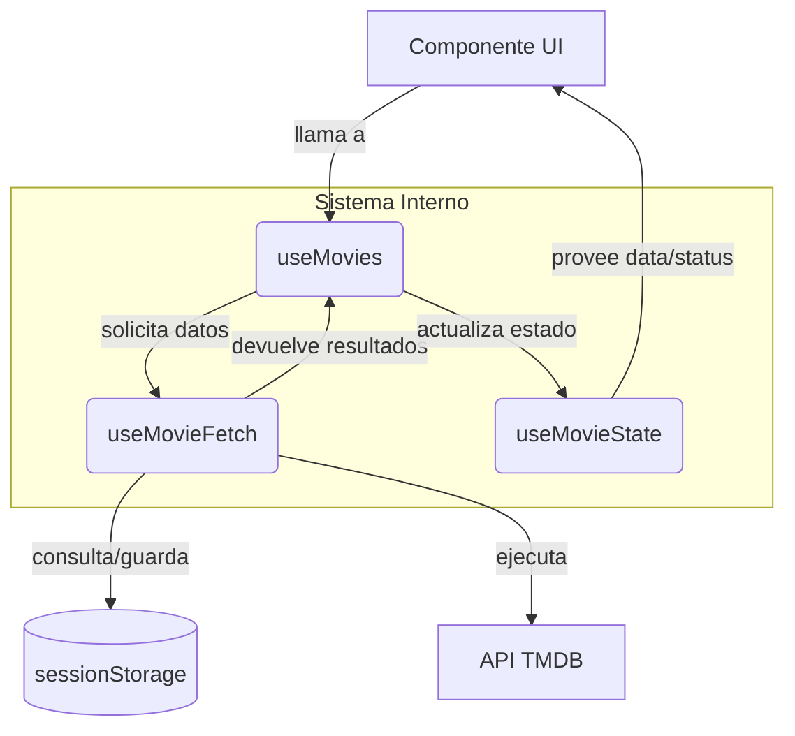

# useMovies Hook System 🎬

Sistema modular de hooks para la gestión de películas en CineSwipe. Este sistema ha sido refactorizado aplicando el **Principio de Responsabilidad Única (SRP)** para garantizar un código escalable, mantenible y fácil de testear.

## ¿Por qué se dividió en 3 hooks?

Originalmente, `useMovies` era un hook monolítico que gestionaba simultáneamente el estado, la lógica de red y las optimizaciones de rendimiento. La división permite:

1.  **Separación de Preocupaciones**: `useMovieState` solo sabe de datos, `useMovieFetch` solo sabe de protocolos y `useMovies` solo sabe de orquestación.
2.  **Mantenibilidad**: Es más fácil rastrear bugs en la lógica de caché o paginación sin afectar la lógica de renderizado.
3.  **Testeabilidad**: Permite realizar unit tests sobre la lógica de estado sin necesidad de mockear llamadas complejas de red, y viceversa.

## Interacción entre Hooks

A continuación se muestra cómo fluye la información entre las capas del sistema:



---

## Guía para Desarrolladores

### Cómo usar el hook principal

Como desarrollador, solo necesitas importar y utilizar `useMovies`. No necesitas preocuparte por los hooks secundarios, a menos que necesites extender la lógica base.

#### Ejemplo de uso real:

```tsx
import { useMovies } from './hooks/movies/useMovies';

const MovieCatalog = () => {
  // Opcionalmente puedes pasar filtros: { genre: 28, year: 2024 }
  const { movies, loading, error, loadMore, hasMore } = useMovies();

  if (error) return <ErrorMessage message={error} />;

  return (
    <div>
      <div className="grid grid-cols-3 gap-4">
        {movies.map(movie => (
          <MovieCard key={movie.id} movie={movie} />
        ))}
      </div>

      {loading && <Spinner />}
      
      {hasMore && !loading && (
        <button onClick={loadMore}>Cargar más películas</button>
      )}
    </div>
  );
};
```

---

## API del Hook

| Propiedad | Tipo | Descripción |
| :--- | :--- | :--- |
| `movies` | `TMDBMovie[]` | Listado acumulado de películas. |
| `loading` | `boolean` | `true` si hay una petición en curso (inicial o paginación). |
| `error` | `string \| null` | Mensaje de error detallado en caso de falla. |
| `loadMore` | `() => void` | Función para solicitar la siguiente página de resultados. |
| `hasMore` | `boolean` | Indica si existen más páginas disponibles en TMDB. |

---

## Errores Comunes (Anti-patrones)

Evita estos 3 errores al trabajar con este sistema:

1.  **Ignorar el estado de carga (`loading`)**: Llamar a `loadMore` repetidamente mientras `loading` es `true`. El hook interno ya previene esto, pero tu UI debería reflejarlo (ej. deshabilitar botones) para mejorar la UX.
2.  **Modificar el estado externo manualmente**: Intentar manipular la lista de `movies` fuera del hook. Si necesitas transformaciones, usa un `useMemo` sobre el resultado de `movies`.
3.  **No manejar el estado de Error**: Asumir que la API siempre responderá correctamente. Siempre implementa un "Error Boundary" o una UI de fallback para el string `error`.

---

> [!TIP]
> **Caché Inteligente**: Este sistema implementa un TTL (Time-To-Live) de 5 minutos mediante `sessionStorage`. Las búsquedas repetidas con los mismos filtros serán instantáneas.
